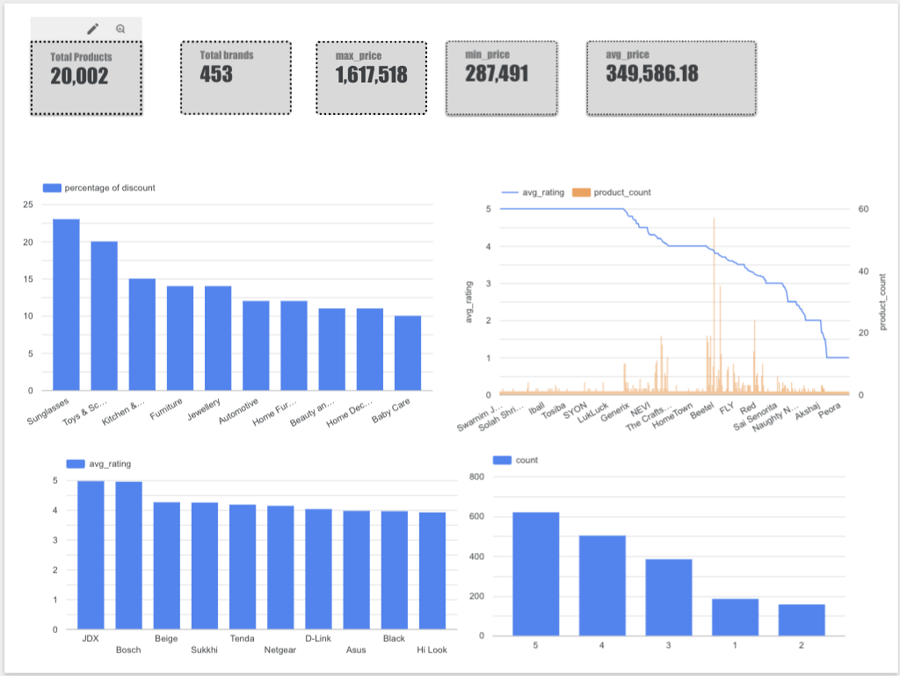

# 💼 Flipkart Product Data Analysis Dashboard

This is a student project built using Flipkart product listings data. The data was analyzed using **Google BigQuery** and visualized in **Looker Studio**.

---

## 📊 Dashboard Preview



---

## 🎯 Project Goals

- Clean and normalize raw e-commerce product data
- Explore useful product insights
- Build a dashboard with key metrics & charts
- Practice real-world SQL & data visualization

---

## 📁 Dataset Overview

Each product record contains:

- Product ID, Name, Brand
- Category (nested)
- Price (Retail + Discounted)
- Ratings
- Specifications

---

## 🧼 Data Cleaning Process

The raw data had lots of messy stuff like symbols, nested arrays, and "null" strings. Here's what I fixed:

### 1. ✅ Cleaned Category Format

Original categories looked like this:

```
["Home Improvement >> Electricals >> Switches"]
```

Cleaned using SQL to remove brackets and quotes:

```sql
REGEXP_REPLACE(product_category_tree, r'[\[\]"]', '')
```

Then split into 3 levels:

```sql
SPLIT(clean_cat_str, ' >> ') AS category_list
category_list[OFFSET(0)] AS main_category
category_list[OFFSET(1)] AS sub_category
category_list[OFFSET(2)] AS sub_sub_category
```

### 2. 🧹 Removed Fake NULL Strings

Some fields had `"null"` as a string. Replaced them with actual NULL:

```sql
NULLIF(brand, 'null')
```

---

## 📊 SQL Queries Used

### 1. 🏷️ Create Normalized Category Table

```sql
CREATE OR REPLACE TABLE product_categories AS
WITH exploded AS (
  SELECT
    uniq_id,
    REGEXP_REPLACE(product_category_tree, r'[\[\]"]', '') AS clean_cat_str
  FROM products
),
split_categories AS (
  SELECT
    uniq_id,
    SPLIT(clean_cat_str, ' >> ') AS category_list
  FROM exploded
)
SELECT
  uniq_id,
  category_list[OFFSET(0)] AS main_category,
  category_list[OFFSET(1)] AS sub_category,
  category_list[OFFSET(2)] AS sub_sub_category
FROM split_categories;
```

---

### 2. 📆 Total Products

```sql
SELECT COUNT(DISTINCT uniq_id) AS total_products
FROM products;
```

---

### 3. 🏷️ Total Brands

```sql
SELECT COUNT(DISTINCT brand) AS total_brands
FROM products
WHERE brand IS NOT NULL;
```

---

### 4. 💰 Price Metrics

```sql
SELECT
  MAX(CAST(retail_price AS FLOAT64)) AS max_price,
  MIN(CAST(retail_price AS FLOAT64)) AS min_price,
  ROUND(AVG(CAST(retail_price AS FLOAT64)), 2) AS avg_price
FROM products
WHERE retail_price IS NOT NULL AND retail_price != 'null';
```

---

### 5. 🔥 Categories with Highest Discounts

```sql
SELECT
  c.main_category,
  c.sub_category,
  ROUND(AVG(100 * (CAST(p.retail_price AS FLOAT64) - CAST(p.discounted_price AS FLOAT64)) / CAST(p.retail_price AS FLOAT64)), 2) AS avg_discount_pct
FROM products p
JOIN product_categories c ON p.uniq_id = c.uniq_id
WHERE p.retail_price IS NOT NULL AND p.discounted_price IS NOT NULL AND p.retail_price > 0
GROUP BY c.main_category, c.sub_category
ORDER BY avg_discount_pct DESC;
```

---

### 6. ⭐ Rating Count Distribution

```sql
SELECT rating, COUNT(*) AS count
FROM products
WHERE rating IS NOT NULL AND rating != 'No rating available'
GROUP BY rating
ORDER BY rating DESC;
```

---

### 7. 🏆 Top Brands by Average Rating

```sql
SELECT brand, ROUND(AVG(CAST(rating AS FLOAT64)), 2) AS avg_rating
FROM products
WHERE brand IS NOT NULL AND rating IS NOT NULL AND rating != 'No rating available'
GROUP BY brand
HAVING COUNT(*) >= 5
ORDER BY avg_rating DESC
LIMIT 15;
```

---

### 8. ⭐ Average Rating by Category

```sql
SELECT
  c.main_category,
  ROUND(AVG(CAST(p.rating AS FLOAT64)), 2) AS avg_rating
FROM products p
JOIN product_categories c ON p.uniq_id = c.uniq_id
WHERE p.rating IS NOT NULL AND p.rating != 'No rating available'
GROUP BY c.main_category
ORDER BY avg_rating DESC;
```

---

## 📊 Dashboard Metrics

Key insights shown:

- ✅ Total number of products
- 🏷️ Total unique brands
- 💸 Max, min, and avg product price
- 🔥 Categories with highest discounts
- ⭐ Most loved brands (based on average rating)
- 📦 Product count by rating (e.g., how many have 5 stars, 4 stars, etc.)

---

## 💻 Tech Stack

- Google BigQuery (SQL)
- Google Looker Studio (Dashboards)
- GitHub (for version control)

---


---

## 🛌 Contact

Made by Subrahmanya 💻✨ — reach out if you want to collaborate!


